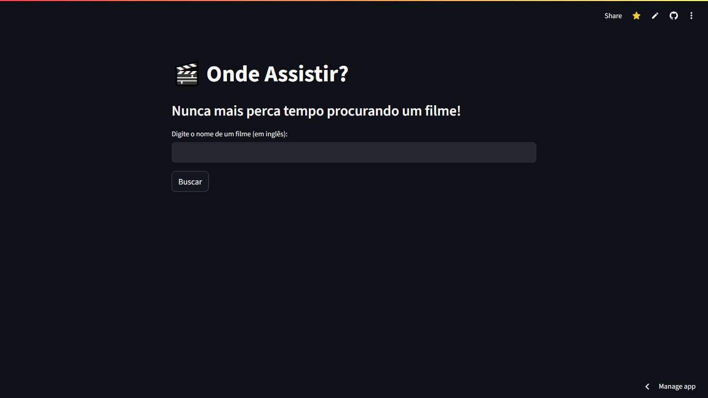
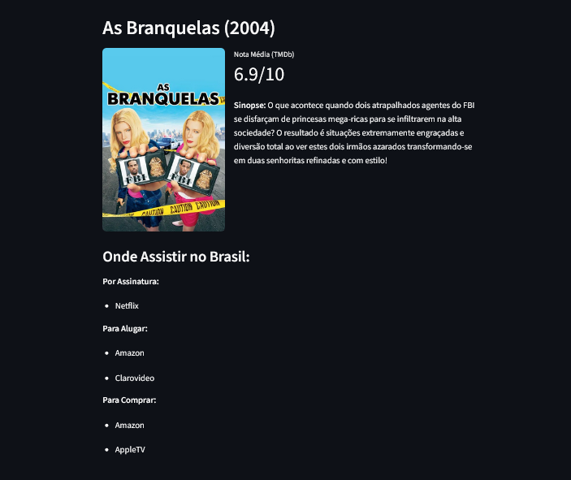

# 🎬 Onde Assistir?

Um aplicativo web que resolve um problema do dia a dia: descobrir rapidamente em quais serviços de streaming um filme está disponível no Brasil.  
O projeto consome e combina dados de duas APIs distintas para fornecer uma resposta completa e centralizada ao usuário.

**[Clique aqui para ver a demonstração ao vivo!](https://onde-assistir.streamlit.app/)**

---

## ✨ Funcionalidades

* **Busca Inteligente:** O mecanismo de busca trata automaticamente variações de títulos (ex: "and" vs "&") para garantir que o utilizador encontre sempre a lista de resultados mais completa.
* **Seleção de Versão:** Para filmes com várias adaptações, como "Pride and Prejudice", o app exibe uma lista para o usuário escolher a versão correta, ordenada pelos filmes mais recentes primeiro.
* **Fluxo Otimizado:** Se a busca retorna um único resultado, a aplicação pula a etapa de seleção e exibe diretamente a página de detalhes, melhorando a experiência do utilizador.
* **Validação de Dados:** A aplicação filtra resultados de busca que não possuem informações essenciais (como nome e ano), evitando exibir opções inválidas para o usuário.
* **Detalhes Completos:** O aplicativo retorna o pôster do filme, a sinopse em português e a nota média de avaliação do TMDb.
* **Tratamento de Erros Robusto:** O app valida os detalhes recebidos das APIs. Se encontrar uma entrada de "filme fantasma" (sem sinopse ou dados válidos), exibe uma mensagem de erro amigável em vez de uma página em branco.
* **Fontes de Streaming:** Exibe uma lista clara e organizada de onde o filme está disponível, separado por **Assinatura, Aluguel e Compra**.
* **Interface Web Interativa:** Construído com Streamlit para uma experiência de usuário limpa, responsiva e com navegação fluida.


---

## 🎯 Objetivos do Projeto

- **Resolver um problema real**: Acabar com a necessidade de buscar manualmente por um filme em múltiplos aplicativos de streaming.
- **Orquestrar APIs**: Desenvolver a lógica para consumir, combinar e apresentar dados de duas fontes diferentes (Watchmode e TMDb).
- **Construir uma Interface Web**: Utilizar a biblioteca Streamlit para criar uma interface de usuário limpa, interativa e amigável.
- **Adotar Boas Práticas de Desenvolvimento**: Implementar o uso de variáveis de ambiente para proteger chaves de API e criar um projeto pronto para deploy.

---

## 🤖 Arquitetura da Solução

O aplicativo funciona como um pipeline que é ativado pela interação do usuário, seguindo um fluxo claro de requisições e processamento de dados:

```text
+--------------------------------+
| 🌐 Interface Web (Streamlit)   |
|--------------------------------|
|   Campo de busca de filme      |
|   (Input do Usuário)           |
+--------------------------------+
                 |
                 | (1. Busca pelo nome do filme em inglês)
                 ▼
+--------------------------------+
| 🤖 API Watchmode (Busca)       |
|--------------------------------|
|  Retorna o ID do Watchmode     |
|  e o ID do TMDb do filme       |
+--------------------------------+
                 |
      +----------+-----------+
      |                      |
(2. Busca pelos        (3. Busca pelas fontes
 detalhes com o          de streaming com o
 ID do TMDb)             ID do Watchmode)
      ▼                      ▼
+----------------+  +-----------------+
| 🤖 API TMDb    |  | 🤖 API Watchmode|
| (Detalhes)     |  | (Fontes)        |
|----------------|  |-----------------|
| Retorna:       |  | Retorna:        |
| - Sinopse (PT) |  | - Lista de      |
| - Nota Média   |  |   Streamings    |
| - Pôster       |  |   (Assinatura)  |
+----------------+  +-----------------+
      |                      |
      +----------+-----------+
                 |
                 | (4. Combina e Exibe os Resultados)
                 ▼
+--------------------------------+
| 🌐 Interface Web (Streamlit)   |
|--------------------------------|
|  Exibe o resultado completo    |
|  e organizado para o usuário   |
+--------------------------------+

```

---

## 📁 Estrutura do Repositório

```
/app-onde-assistir/
|
├── 📂 imgs/          # Pasta com os screenshots do projeto
|   ├── print1.png    
|   └── print2.png
|
├── .env              # Arquivo local com as chaves de API (ignorado pelo Git)
├── .gitignore        # Ignora arquivos sensíveis e pastas irrelevantes para o Git
├── buscador.py       # Script principal com a lógica e interface Streamlit
├── README.md         # Esta documentação do projeto
└── requirements.txt  # Dependências para rodar o app

```
---

## 📄 Fonte dos Dados (Data Source)

Este projeto não utiliza um dataset estático. Ele consome dados em tempo real de duas APIs RESTful, garantindo que as informações estejam sempre atualizadas:

- **[Watchmode API](https://watchmode.com/api/)**  
  Fonte principal para descobrir em quais serviços de streaming (Netflix, Prime Video, etc.) um título está disponível, filtrando por região (Brasil).

- **[TMDb API (The Movie Database)](https://developer.themoviedb.org/docs)**  
  Utilizada para enriquecer os dados, buscando informações detalhadas como sinopse em português, nota média e pôster oficial.
  
---

## 🛠️ Tecnologias Utilizadas

Este projeto foi uma oportunidade para praticar a orquestração de diferentes ferramentas e serviços:

* **Linguagem:** Python
* **Interface Web:** Streamlit
* **APIs Externas:**
    * **Watchmode API:** Para obter os dados de disponibilidade nos serviços de streaming.
    * **The Movie Database (TMDb) API:** Para buscar os detalhes dos filmes, como pôster, sinopse e avaliação.
* **Gerenciamento de Dependências:** `pip` e `requirements.txt`
* **Segurança:** Utilização de variáveis de ambiente (`.env`) para proteger as chaves de API.

---

## 🖼️ Prévia do Projeto

Tela de busca e resultado final para um filme, exibindo pôster, nota, sinopse e os serviços de streaming disponíveis.





---


## 🚀 Como Executar Localmente

Você pode rodar este projeto na sua própria máquina seguindo os passos abaixo:

1.  **Clone o repositório:**
    ```bash
    git clone [https://github.com/alinepax/app-onde-assistir.git](https://github.com/alinepax/app-onde-assistir.git)
    cd seu-repositorio
    ```

2.  **Crie o arquivo de ambiente:**
    * Crie um arquivo chamado `.env` na raiz do projeto.
    * Dentro dele, adicione suas chaves de API:
        ```
        WATCHMODE_API_KEY="SUA_CHAVE_DO_WATCHMODE"
        TMDB_API_KEY="SUA_CHAVE_DO_TMDB"
        ```

3.  **Instale as dependências:**
    ```bash
    python -m pip install -r requirements.txt
    ```

4.  **Execute o aplicativo Streamlit:**
    ```bash
    streamlit run buscador.py
    ```

5.  Abra seu navegador e acesse o endereço `http://localhost:8501`.

---

## ©️ Atribuição e Créditos

Este projeto utiliza dados e imagens fornecidos por terceiros.

* Todos os dados detalhados de filmes, como sinopse, nota de avaliação e pôsteres, são fornecidos pela **[The Movie Database (TMDb) API](https://www.themoviedb.org/)**. Este produto usa a API do TMDb, mas não é endossado ou certificado pelo TMDb.
* As informações sobre a disponibilidade dos filmes nos serviços de streaming são fornecidas pela **[Watchmode API](https://watchmode.com/)**.

---

## 👩‍💻 Sobre a Autora

Desenvolvido por **[Aline Paz](https://github.com/alinepax)**  
📫 Me encontre no [LinkedIn](https://www.linkedin.com/in/alinedapaz/)  
📧 Email para parcerias: aline.santospaz@gmail.com  
🎯 Este projeto faz parte do meu portfólio como profissional em transição para a área de Dados e Tecnologia.

---

⭐ Se você gostou, deixe uma estrela no repositório!
